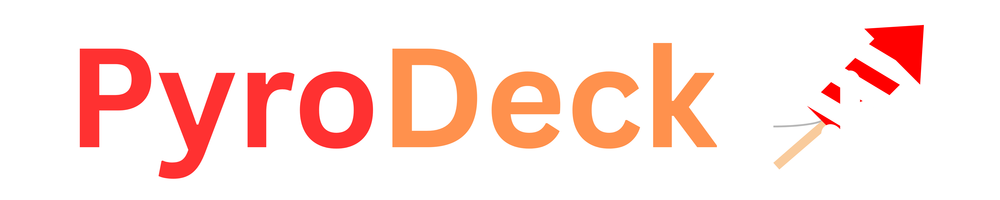

[](https://ko-fi.com/Q5V3222BJU)



## PyroDeck Node
Open-source distributed fireworks firing system based on RS485.


## Features
- Multi-node architecture
- OLED Interface
- RS485 communication
- Continuity testing
- Plenty of Safety Interlocks

## Images
Coming Soon

## Hardware
- Custom PCBs
  - MCU Board
  - Relay Board
  - UI Board
  - (WIP) Power Board
- ATMEGA1284p
- MAX485
- SSD1306 OLED Display

## Building
1. Install PlatformIO
2. Clone repository
3. Open in VSCode
4. Build

```bash
pio run
```

## Status
Pre-release / Development
Not intended for production use.

## To-Do
- [ ] Maybe: LoRa Integration for wireless capabilities
- [ ] Improved wired communication (Reduce packet loss)
- [ ] Encrypted communication
- [ ] Create docs 

##

